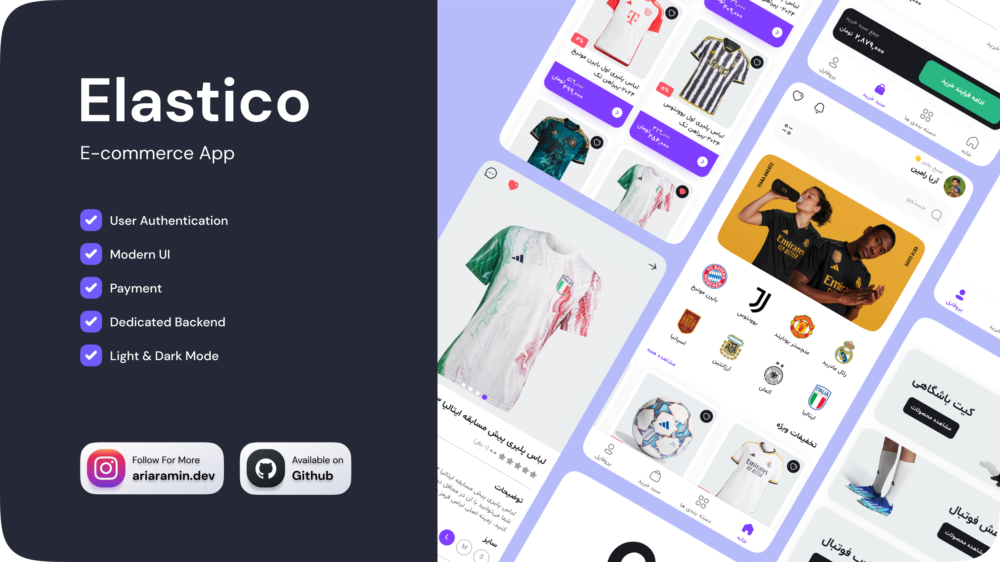

# 🛍️ Elastico




## 🚀 Overview

“Elastico” is a comprehensive application built using Flutter, with Pocketbase serving as its backend. It offers various features to enhance user experience, including user authentication, product browsing, detailed product pages, search functionality, and more.

## ⚙️ Getting Started

Clone this repository and run the following commands:

```
flutter pub get
flutter run
```

For start the backend application you should download [Pocketbase](https://pocketbase.io/docs/). Once you've extracted the archive, locate the extracted directory and add or replace the “pb_data” folder within it. Then start the application by running the following command:

```
./pocketbase serve
```

## 💻 Technologies:


## 💰 You can help me by Donating
<p><a href="https://www.buymeacoffee.com/ariaramin"> </a></p>
<a href="https://www.coffeebede.com/ariaramin">  </a>
